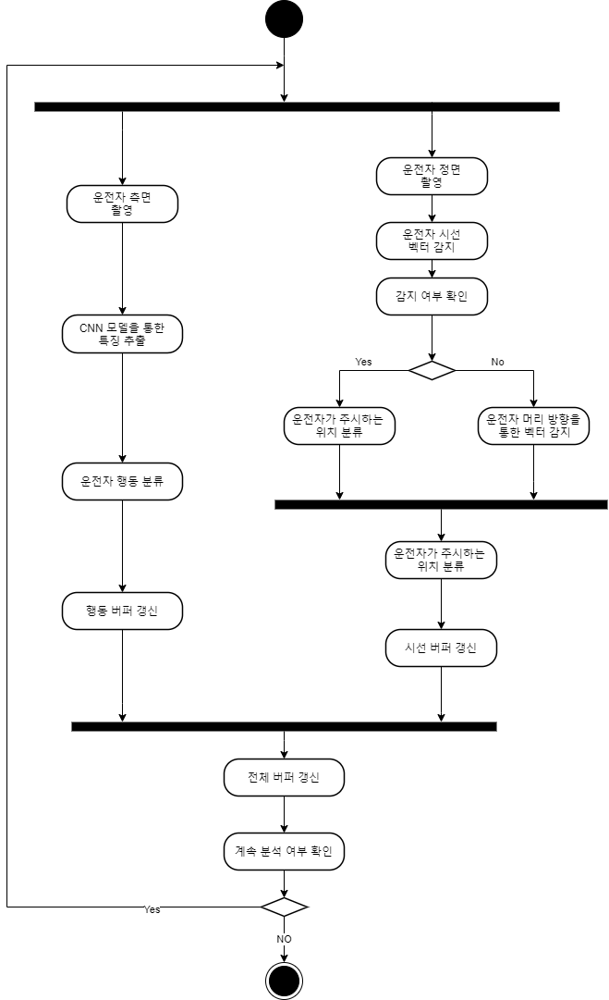
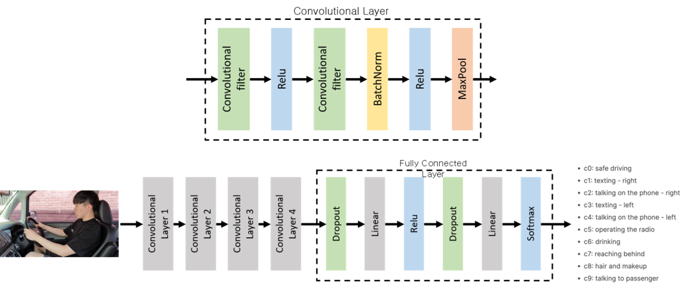
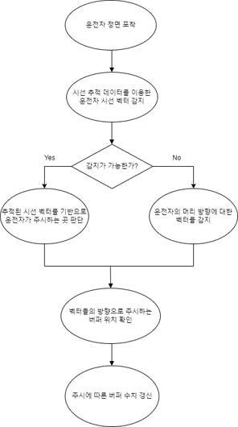
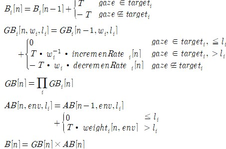
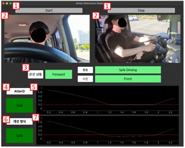

# Driver Distraction Detection

운전자 시선 및 행동 분석을 이용한 운전자 주의 산만 

## 요약
AttenD 알고리즘은 시선 방향에 대한 벡터를 받아 운전에 필요한 곳을 제대로 주시하고 있는지 버퍼를 통해 체크하는 알고리즘으로써, 주시하는 시간에 따른 버퍼들의 수치를 통해 운전자의 집중도를 예측한다.
한편 이는 차창 근처에서 휴대폰을 보는 등의 시선 방향만으로는 완전히 파악할 수 없는 정보나 후진이나 커브, 차선 변경 등의 전방을 상대적으로 덜 주시하게 되는 상황 등에 대한 처리가 완전하지 못하다.
따라서 본 논문에서는 이런 문제들을 해결하기 위해 자세를 포착하여 추가적인 정보를 얻고 후면 버퍼를 이용하여 수치 측정에 사용하는 버퍼를 늘리는 방식으로 이런 문제를 해결할 수 있도록 한다.

## 구성원

|이름|소속|학번|이메일|
|:---:|:---:|:---:|:---:|
|이상화|컴퓨터공학과|2017104009|devlsh0124@gmail.com|
|안윤모|컴퓨터공학과|2017104002|aym0619@khu.ac.kr|

## 연구 배경
최근 머신 러닝, 딥러닝과 같은 SW 기술 발전으로 인해 차량에 탑재되는 자율 주행 기술이 점진적으로 발전하고 있다.
미국 자동차 기술학회(SAE)는 2014년 1월 자율 주행 기술을 기능 및 기술적인 측면에서 0단계부터 5단계까지 총 6단계로 구분하였다.
이 중, 완전 자동화 주행에 해당하는 5단계를 제외하고 운전자의 개입은 필수적이다. 하지만 현재 자율 주행 기술은 자율 주행으로 가장 유명한 Tesla 역시 2단계에 해당하며, 다양한 기술적 문제로 인해 5단계 도달이 늦춰지고 있다.
이런 실정임에도 현재 몇몇 운전자는 부분 자동화를 제공하는 자동차에 의존한 채 운전에 집중하지 않는 경우가 있다. 따라서, 지금 시점에서는 DSM(Driver State Monitoring) 기술을 이용해 운전자의 상태를 분석하고 위험을 감지하는 것이 중요하다.
이런 감지 기술 중, 운전자 시선(Gaze)과 머리 자세(Head Pose)를 통해 운전자의 운전 주의 산만을 측정하는 AttenD 알고리즘이 최근 개발되었다. AttenD 알고리즘은 시간 버퍼를 활용하며 해당 버퍼의 수치를 통해 주의 산만 정도를 정량적으로 표현한다.

## 프로젝트 소개

<p align="center"></p>

차량에서 실시간으로 촬영한 운전자의 측면과 정면 이미지를 통해 현재 운전자의 행동 및 차량 내 시선 영역을 파악한다.
이 정보를 기반으로 행동 버퍼와 시선 버퍼의 수치를 변화시키며 현재 운전자의 주의산만 여부를 파악한다.

### 운전자 행동 분류



실시간 환경에서 작동시키기 위해 기존 VggNet과 같은 모델을 사용하지 않고 위와 같이 훨씬 가벼운 모델을 만들어 사용하였다.

### 운전자 시선 영역 분류

<p align="center"></p>

운전자 시선 영역의 분석은 아래와 같은 과정으로 이루어진다.
1. 운전자 눈동자 및 머리 인식
2. 영역 산출
   1. 눈동자가 인식이 된 경우
      1. 눈동자를 통해 운전자가 보고 있는 영역의 좌표 산출
      2. 좌표가 해당하는 영역 확인
   2. 눈동자가 인식이 되지 않은 경우
      1. 머리 벡터를 통해서 머리의 정면 벡터가 가리키는 좌표 산출
      2. 좌표가 해당하는 영역 확인

### 버퍼 수치 관리

<p align="center"></p>

시선 버퍼의 경우, 각 영역 별 버퍼가 존재하며 상황에 따라 각 버퍼의 증감 수치가 정해져있다.
이를 통해 상황 별 시선의 중요도를 관리한다.
또한 최종적인 시선 버퍼 수치는 모든 영역의 수치를 곱하는 연산을 통해 이루어진다.

행동 버퍼의 경우, 상황 별 동작에 가중치를 부여하여 상황에 따라 행동이 미치는 영향을 관리한다.

최종적으로, 행동 버퍼 수치와 시선 버퍼 수치를 곱함으로써 최종 주의산만도 수치가 나오게 된다.

### 실시간 모니터링

<p align="center"></p>

1. 프로그램 작동을 위한 Start, Stop 버튼
2. 실시간 측면, 정면 카메라 화면 표시
3. 현재 운전 상황, 운전자 행동, 시선 영역 표시
4. 기존 AttenD 알고리즘을 활용한 경우의 주의산만 여부
5. 기존 AttenD 알고리즘을 활용한 경우의 Buffer 수치 그래프
6. 개선한 알고리즘을 활용한 경우의 주의산만 여부
7. 개선한 알고리즘을 활용한 경우의 Buffer 수치 그래프

## 프로젝트 구조
```
├─docs
│  ├─KCC논문
│  ├─기초조사서
│  ├─면담확인서
│  │  ├─3월
│  │  ├─4월
│  │  └─5월
│  └─중간보고서
│      └─그림
├─imgs
└─src
   ├─GUI
   │  ├─config
   ├─Modules
   │  ├─ActivityClassifier
   │  │  ├─eval
   │  │  ├─model
   │  │  ├─train
   │  │  ├─weight
   │  ├─Buffer
   │  ├─BufferControl
   │  ├─FrameSource
   └─utils

```